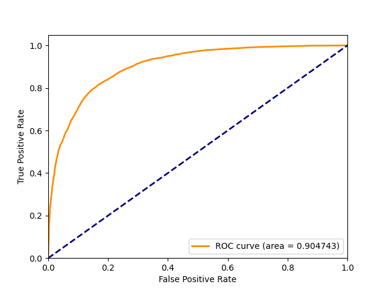
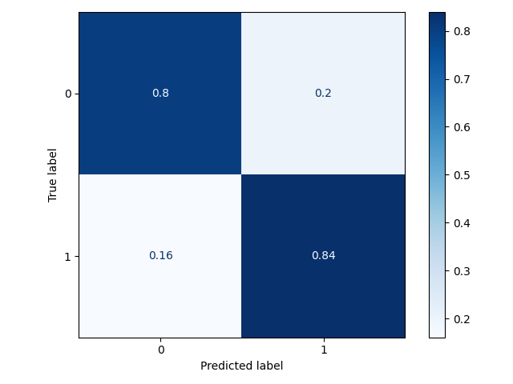

# Classification with Embeddings

Classification with Embeddings (`classification-with-embeddings`) is a tool that facilitates evaluating embedding-based classification methods on
provided datasets. It is developed as part of the following suite of
projects: [EHR Explorer](https://github.com/jernejvivod/ehr-explorer),
[EHR Explorer API](https://github.com/jernejvivod/ehr-explorer-api),
and [Classification With Embeddings](https://github.com/jernejvivod/classification-with-embeddings).
It can also be used in a stand-alone manner.

## Quickstart

This section explains the steps needed to install the package.

## Installing Classification with Embeddings

The Classification with Embeddings package (`classification-with-embeddings`) can be installed following the next steps.

1. Clone the repository:

```bash
git clone https://github.com/jernejvivod/classification-with-embeddings
```

2. Ensure that you have Python 3 installed. Install the package requirements with:

```bash
python -m pip install -r requirements.txt
```

This will install all the required dependencies.

3. Install the package with:

```bash
python -m pip install .
```

4. Verify that the package is installed correctly by running the following:

```bash
python -c "import classification_with_embeddings; print(classification_with_embeddings.__version__)"
```

If the installation was successful, this command will print the version of the package that was installed.

## Commands and Tasks

The Classification with Embeddings package is able to perform three main tasks: computing entity embeddings, performing
a train-test split of the data and evaluating various embedding methods in classification tasks.

### Computing Entity Embeddings

We specify the entity embedding computation task by providing the `get-entity-embeddings` argument.

Running `classification_with_embeddings get-entity-embeddings --help` prints out the available options:

```
usage: classification-with-embeddings get-entity-embeddings [-h] [--method {word2vec,starspace,fasttext,pre-trained-from-file,doc2vec}] --train-data-path TRAIN_DATA_PATH [--output-dir OUTPUT_DIR] [--starspace-path STARSPACE_PATH] [--starspace-args STARSPACE_ARGS] [--word2vec-args WORD2VEC_ARGS] [--fasttext-args FASTTEXT_ARGS] [--doc2vec-args DOC2VEC_ARGS]

options:
  -h, --help            show this help message and exit
  --method {word2vec,starspace,fasttext,pre-trained-from-file,doc2vec}
                        Method of generating entity embeddings
  --train-data-path TRAIN_DATA_PATH
                        Path to file containing the training data in FastText format
  --output-dir OUTPUT_DIR
                        Path to directory in which to save the embeddings
  --starspace-path STARSPACE_PATH
                        Path to StarSpace executable
  --starspace-args STARSPACE_ARGS
                        Arguments passed to StarSpace implementation (key-value pairs such as val=1 enclosed in quotes with no commas separated by spaces)
  --word2vec-args WORD2VEC_ARGS
                        Arguments passed to Word2Vec implementation (key-value pairs such as val=1 enclosed in quotes with no commas separated by spaces)
  --fasttext-args FASTTEXT_ARGS
                        Arguments passed to fastText implementation (key-value pairs such as val=1 enclosed in quotes with no commas separated by spaces)
  --doc2vec-args DOC2VEC_ARGS
                        Arguments passed to Doc2Vec implementation (key-value pairs such as val=1 enclosed in quotes with no commas separated by spaces)
```

The `method` option is used to specify the entity embedding method to use. We can choose between several options:

- The `word2vec` value is used to specify Word2Vec embeddings.
- The `starspace` value is used to specify StarSpace embeddings.
- The `fasttext` value is used to specify FastText embeddings.
- The `pre-trained-from-file` value is used to specify the use of pre-trained embeddings from a file.
- The `doc2vec` value is used to specify the use of Doc2Vec embeddings.

The `--train-data-path` option is used to specify the path to the training data (currently only the FastText data format
is supported).

The `--output-dir` option allows us to specify the path to the directory in which to store the results.
Defaults to the current directory if not specified.

If using the `starspace` value for the `method` option, we need to specify the path to the StarSpace executable using
the `--starspace-pah` option. We can supply arguments to the StarSpace executable in the form of key-value pairs
in double quotes with no commas and separated by spaces using the `--starspace-args` option.

The values for the `--word2vec-args`, `--fasttext-args`, and `--doc2vec-args` options should use the same form as the
one described for `--starspace-args`. These values are used to provide custom arguments to the Word2Vec, FastText, and
Doc2Vec implementations respectively.

An example of data in FastText format expected by this task is given below (two rows, abbreviated). Each row contains
features/words corresponding to an entity. The entity's class is given at the end of a line prefixed with `__label__`.

```
probably alltime favorite movie story selflessness sacrifice dedication ... startling dozen thumb movie __label__1
saw movie came recall scariest scene big bird eating men dangling helplessly ... make scary possible wellworn formula rule __label__0
```

### Performing a Train-Test Split

We specify the train-test split task by providing the `train-test-split` argument.

Running `classification_with_embeddings train-test-split --help` prints out the available options:

```
usage: classification-with-embeddings train-test-split [-h] --data-path DATA_PATH [--train-size TRAIN_SIZE] [--no-stratify] [--output-dir OUTPUT_DIR]

options:
  -h, --help            show this help message and exit
  --data-path DATA_PATH
                        Path to file containing the data in fastText format
  --train-size TRAIN_SIZE
                        Proportion of the dataset to include in the train split
  --no-stratify         Do not split the data in a stratified fashion
  --output-dir OUTPUT_DIR
                        Path to directory in which to save the resulting files containing the training and test data
```

The `--data-path` option is used to specify the path to the data (currently only the FastText data format is supported).

The `--train-size` option is used to specify the training set size. The value should be a float between 0.0 and 1.0
specifying the portion of samples in the data to include in the training set.

The `--no-stratify` flag can be set to suppress the use of data stratification when performing the train-test split.

The `--output-dir` option allows us to specify the path to the directory in which to store the results.
Defaults to the current directory if not specified.

The expected format of the input data is the same as in the example given in the previous section.

The output file names are suffixed with the `train` or `test` suffix. So if we specify a file called `data.txt` as the file containing the input data, files `data_train.txt` and `data_test.txt` will be created in the specified output
directory.

### Performing Evaluation

We specify the evaluation task by providing the `evaluate` argument.

Running `classification_with_embeddings evaluate --help` prints out the available options:

```
usage: classification-with-embeddings evaluate [-h] --method {word2vec,starspace,fasttext,pre-trained-from-file,doc2vec} [{word2vec,starspace,fasttext,pre-trained-from-file,doc2vec} ...] --train-data-path TRAIN_DATA_PATH [TRAIN_DATA_PATH ...] --test-data-path TEST_DATA_PATH [TEST_DATA_PATH ...] [--validation-size VALIDATION_SIZE] [--no-stratify] [--param-grid-path PARAM_GRID_PATH] [--cv CV] [--embeddings-path EMBEDDINGS_PATH]
                                               [--doc2vec-model-path DOC2VEC_MODEL_PATH] [--binary] [--results-path RESULTS_PATH] [--internal-clf {logistic-regression,random-forest,svc,dummy}] [--internal-clf-args INTERNAL_CLF_ARGS]

options:
  -h, --help            show this help message and exit
  --method {word2vec,starspace,fasttext,pre-trained-from-file,doc2vec} [{word2vec,starspace,fasttext,pre-trained-from-file,doc2vec} ...]
                        Entity embedding method to evaluate
  --train-data-path TRAIN_DATA_PATH [TRAIN_DATA_PATH ...]
                        Path to file containing the training data in fastText format (for training internal classifiers)
  --test-data-path TEST_DATA_PATH [TEST_DATA_PATH ...]
                        Path to file containing the test data in fastText format
  --validation-size VALIDATION_SIZE
                        Proportion of the dataset to use for hyperparameter tuning
  --no-stratify         Do not split the data in a stratified fashion
  --param-grid-path PARAM_GRID_PATH
                        Path to parameter grid in JSON format
  --cv CV               Number of folds to use when doing cross-validation
  --embeddings-path EMBEDDINGS_PATH
                        Path to stored feature embeddings
  --doc2vec-model-path DOC2VEC_MODEL_PATH
                        Path to stored Doc2Vec model
  --binary              Embeddings are stored in binary format
  --results-path RESULTS_PATH
                        Path to directory in which to save the results
  --internal-clf {logistic-regression,random-forest,svc,dummy}
                        Internal classifier to use (if applicable)
  --internal-clf-args INTERNAL_CLF_ARGS
                        Arguments passed to internal classifier if applicable (key-value pairs such as val=1 enclose in quotes with no commas separated by spaces)
```

The `--method` option is used to specify the embedding method used to get the embeddings. The value is only used to
provide the name of the method for use when formatting the output.

The `--train-data-path` option is used to specify the path to the training data (currently only the FastText data format
is supported). This data is used to obtain the internal classifier used to perform classification on the aggregated
embeddings.

The `--train-data-path` option is used to specify the path to the training data (currently only the FastText data format
is supported). This data is used to obtain the internal classifier used to perform classification on the aggregated
embeddings.

The `--test-data-path` option is used to specify the path to the test data (currently only the FastText data format
is supported). The classification metrics are computed using this dataset.

The `--validation-size` option allows us to specify the size of the validation set used when training the internal
classifier (if applicable) using grid-search. The value should be a float between 0.0 and 1.0 specifying the portion of
samples in the
training set to include in the validation set.

The `--no-stratify` flag can be set to suppress the use of data stratification when performing the train-test split.

The `--param-grid-path` option can be used to specify the path to a file containing the parameter grid for grid-search
to use when training the internal classifier.

The `--cv` option can be used to specify the number of folds to use when doing cross validation when training the
internal classifier using grid-search.

The `--embeddings-path` option is used to specify the path to the stored computed embeddings (if applicable). We can use
this if we want to train the internal classifier using already computed embeddings.

The `--doc2vec-model-path` option can be used to specify the path to the trained Doc2Vec model to use (if applicable).

The `--binary` flag is used (if using stored embeddings) to specify that the embeddings are stored in binary format.

The `--results-path` option allows us to specify the path to the directory in which to store the results.
Defaults to the current directory if not specified.

The `--internal-clf` option allows us to specify the internal classifier to use

Possible values are:

- `logistic-regression` corresponding to logistic regression.
- `random-forest` corresponding to a random forest classifier.
- `svc` corresponding to a support-vector-machine classifier.
- `dummy` corresponding to a dummy (sanity-check) classifier.

The `--internal-clf-args` option can be used to specify custom arguments for the internal classifier. The arguments
should be formatted as key-value pairs in double quotes with no commas and separated by spaces.

The evaluation task produces a classification report, a ROC plot and a confusion matrix plot in the specified directory
for results. Examples of results are given below.

##### Classification Report:
```
              precision    recall  f1-score   support

           0       0.83      0.80      0.82      5000
           1       0.81      0.84      0.82      5000

    accuracy                           0.82     10000
   macro avg       0.82      0.82      0.82     10000
weighted avg       0.82      0.82      0.82     10000
```

##### ROC Curve and Confusion Matrix Plots
<div style="display:flex;">
    
    
</div>

#### Using Multiple Data in the Evaluation Task

The package supports the use of multiple sources of data where each row in each dataset should refer to the same
entity. This can be used to combine different sources of data referring to the same entity being classified.

We can use multiple datasets by simply specifying more datasets for the `--train-data-path` and `--test-data-path`
options.

## Using Pre-Defined Workflows

The `run_conig_examples` folder contains some pre-defined workflows that can be used to extract data. It contains
directories containing shell scripts as well as configuration files containing the configurations for a particular
workflow.

Running the `run.sh` shell scripts for a particular workflow performs that functionality using parameters specified in
the `config.cfg` file in the `config` directory.

The results are stored in the `results` directory in the directory of the task we are running.

The pre-defined workflows are a work in progress. New ones will be added and existing ones will be improved in the
near future.
